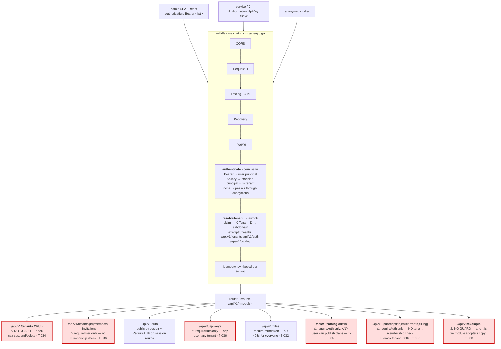
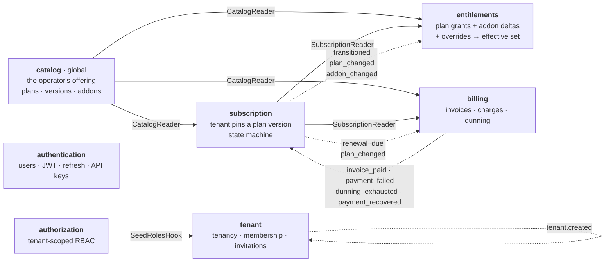
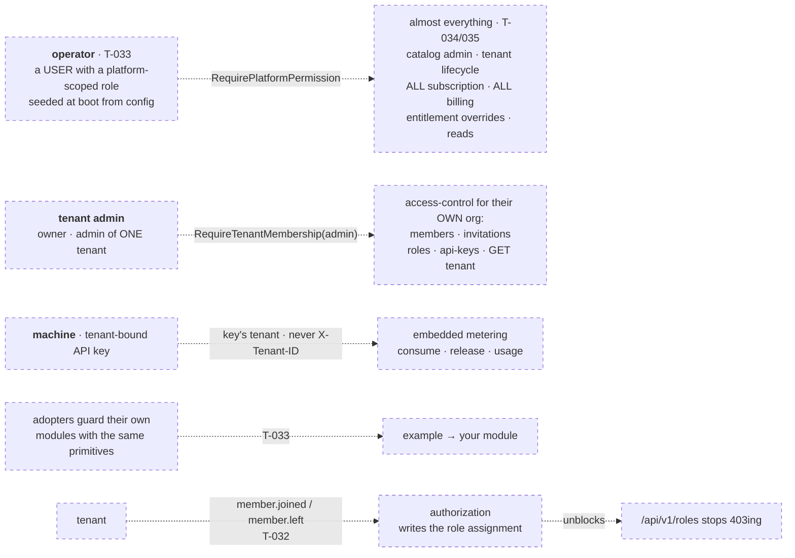

# SaaS Backend Skeleton — Architecture & Implementation Plan

## Context

This repository is a **reusable Go backend skeleton for SaaS products**: a modular monolith using DDD + hexagonal architecture, containing seven modules (tenant, authentication, authorization, catalog, subscription, entitlements, billing). Whenever a new SaaS is started, this repo is the starting point. It must itself be able to become a SaaS later (phase 2: webhooks/API keys for external consumers).

## Key Decisions (defaults — each is deliberately swappable)

| Concern | Decision | Rationale |
|---|---|---|
| Language | Go (latest stable, currently 1.24.x), single `go.mod` | Monolith module-based; one module, packages as boundaries |
| Persistence | PostgreSQL + `pgx/v5` + `sqlc` | Type-safe SQL, no ORM leaking into domain |
| Migrations | `goose` (embedded, per-module folders) | Simple, supports Go + SQL migrations |
| Tenancy | Shared schema, `tenant_id` on every tenant-scoped table, enforced via repository layer + tenant-aware context. DB-enforced Postgres RLS is a defense-in-depth second layer (T-030) — the runtime role already runs without `BYPASSRLS`; see [`docs/RUNNING.md`](./RUNNING.md) §7 | Simplest to operate for a starter; isolation strategy hidden behind repositories so schema-per-tenant can replace it per-SaaS |
| Deployment | Two Docker images from this monorepo — `api` (Go, `scratch`) and `admin` (nginx, runtime-configured) — published to GHCR by CI on `main`. Migrations apply on API startup; a split owner/app DB role is available (`MIGRATION_DATABASE_URL`) | One `docker compose up` runs the whole stack; the admin image is generic and configured per environment at container start |
| Transport | REST, stdlib `net/http` (1.22+ method routing), one router per module mounted at composition root | Zero framework lock-in |
| Module comms | Synchronous: small public **ports** (interfaces) each module exposes. Asynchronous: **domain events** on an in-process bus backed by a **transactional outbox** | Outbox makes phase-2 webhooks/broker trivial; events keep billing/entitlements decoupled from subscription |
| IDs | UUIDv7 | Sortable, index-friendly |
| Auth tokens | JWT access (short-lived) + rotating refresh tokens | Standard; provider-agnostic |
| Passwords | argon2id | Current best practice |
| Background work | Minimal scheduler/worker abstraction (Postgres advisory-lock leader election) for renewals, dunning, trial expiry | No external queue dependency in the skeleton |
| Frontend | React 19 + TypeScript + Vite SPA in `admin/`, on the **Inspinia v5** theme as design system; theme demo preserved under `/demo/*` as a component reference | Buy-not-build UI kit; every screen reuses theme components — see `docs/FRONTEND.md` |
| Frontend config | Runtime-injected `window.__APP_CONFIG__` (`app-config.js` rendered from env by the container entrypoint): API base URL, tenant mode (header/subdomain), branding | One generic Docker image per version — deploy-time configuration, nothing baked into the bundle |

## Repository Layout

```
cmd/api/main.go                  # composition root: config, db, bus, mounts all modules
internal/
  platform/                      # shared kernel (NO business logic)
    config/                      # env-based config loading
    httpx/                       # server, middleware (request-id, recovery, auth, tenant), problem+json errors
    postgres/                    # pool, tx manager (UnitOfWork), migration runner
    events/                      # event bus interface, in-proc impl, transactional outbox + relay worker
    jobs/                        # scheduler abstraction + Postgres-locked runner
    id/ clock/                   # UUIDv7 gen, clock abstraction (testability)
    authctx/                     # principal + tenant extraction from context
  modules/
    tenant/
    authentication/
    authorization/
    catalog/
    subscription/
    entitlements/
    billing/
migrations/                      # per-module: migrations/<module>/NNN_*.sql
admin/                           # frontend SPA (React+Vite, Inspinia design system) — see docs/FRONTEND.md
docs/PLAN.md                     # this document
docker-compose.yml               # postgres for local dev
Makefile                         # build, test, lint, sqlc gen, migrate
```

### Per-module internal structure (hexagonal)

```
modules/<name>/
  ports/           # PUBLIC surface for other modules: facade interface + published event types
  internal/        # compiler-private to this module (Go internal/ visibility)
    domain/        # entities, value objects, domain events, domain services, repository interfaces
    service/       # use cases (command/query handlers); owns transaction boundaries
    adapters/
      rest/        # REST handlers (driving adapter)
      postgres/    # repository implementations (driven adapter)
  module.go        # New(app.Deps) *Module — returns its port + http.Handler + event subscriptions
```

**Enforced rules**:
- **Cross-module privacy (compiler-enforced):** `domain`/`service`/`adapters` live under the module's `internal/` directory, so the Go compiler forbids any other module from importing them — a module reaches another module only through its public `ports` package.
- **Domain purity (depguard):** a module's `domain` package may import only the standard library, `uuid`, and `platform/apperr` — never service/adapters, the platform kernel, or other modules.
- **Platform isolation (depguard):** the platform kernel must not import business modules or the composition layer (`internal/app`).
- A CI self-test (`scripts/archcheck.sh`) writes a deliberately illegal import and asserts `make lint` fails, proving the rules actually bite.
- Each module owns its own Postgres schema (`tenant.*`, `billing.*`, …). No cross-module joins; read-your-own-data or call the port.

**Composition root** (`cmd/api`): `config → observability → Postgres pool → migrations → build `app.Deps` → wire each `app.Module` (mount its handler under `/api/v1/<name>`, register its subscriptions on the bus) → start the outbox relay + job runner → serve`. The `example` module is a bootable reference implementation of this pattern (delete it and `migrations/example/` for a real SaaS).

## System architecture (as built)

These diagrams describe the system **as the code actually is**, not as intended —
including the places where it is not yet guarded. Planned work is drawn
separately, below.

### Request path

Every request crosses one middleware chain before any module sees it. Note that
`authenticate` is **permissive** — a request with no credential passes through
*unauthenticated* rather than being rejected, so **each surface is responsible for
its own guard**. That is where the current gaps come from.



Every ⚠️ surface above is a live gap: `authenticate` being permissive means each
surface guards itself, and for the tenant-scoped ones the guard is either absent
or only `requireAuth` — which proves *a* user, never *this tenant's* member. That
is the T-036 cross-tenant IDOR, and it is the single most serious issue here.

### Module graph

**Solid** = synchronous dependency on another module's public `ports` facade,
injected at the composition root. **Dashed** = asynchronous event, published to
the transactional outbox, delivered by the relay to the in-proc bus, and handled
idempotently. No module imports another module's internals — the compiler forbids
it.



Not drawn, to keep the graph legible: every module sits on the **platform kernel**
(UnitOfWork, outbox + relay, event bus, advisory-locked job runner, audit log) —
`subscription`, `entitlements` and `billing` each register jobs with it.
`authentication` supplies the `TokenVerifier` / `APIKeyAuthenticator` to the auth
middleware, and `tenant` supplies the `TenantReader` to the tenant-resolution
middleware; both appear in the request-path diagram above.

**The seam that is missing.** `tenant` publishes `member.joined` / `member.left`,
and `tenant.MembershipPort()` (`ports.MembershipReader`) exists — but **nothing
consumes either**. `authorization` resolves permissions purely from
`authz.role_assignments`, and nothing ever writes an assignment, so RBAC cannot
be bootstrapped (**T-032**). The dotted edge below is the fix.

### Where this is going

**Audience model** (confirmed with the product owner): tenants are **customers**;
they do not manage their commercial relationship. The **operator is a regular user
holding platform-scoped RBAC roles** (not a separate identity) and manages almost
everything — catalog, and each tenant's lifecycle/subscription/billing/
entitlements. A tenant admin manages only **access to its own org** (members,
roles, API keys). So authorization has **one mechanism, two scopes**: platform
(`tenant_id` null) and tenant.



The planned work, in dependency order (full classification in
[`TASKS.md`](TASKS.md) T-036):

1. **T-036** 🔴 — the top-severity item. *Every* endpoint today trusts a
   client-supplied `X-Tenant-ID` with **no membership check**, so any logged-in
   user can act on any tenant (proven live: mint API keys, set overrides, suspend
   or delete a stranger's tenant). Fix: **deny-by-default** at the composition
   root — a route is denied unless it declares a class (public / global-user /
   tenant-admin / machine / operator).
2. **T-032** — `authorization` subscribes to `tenant.member.joined` and writes the
   matching role assignment (unassigns on `member.left`), closing the
   membership → permission seam so RBAC is bootstrappable at all.
3. **T-033** — the **operator** = a user with **platform-scoped** roles (one RBAC
   mechanism, two scopes), seeded at boot from config — which is also the grant
   that breaks T-032's bootstrap for the platform scope. Ships the reusable guards
   `RequirePlatformPermission` and `RequireTenantMembership`, demonstrated in the
   `example` module so adopters inherit the secure default.
4. **T-034 / T-035** — apply the classification: catalog admin, tenant lifecycle,
   all subscription/billing/entitlements become **operator**; only membership,
   roles and keys stay tenant-admin. `reactivate` is the tell — a customer must
   never undo the operator's enforcement lever.

## Module Specifications

### 1. Tenant
The root of isolation; everything else is tenant-scoped.
- Tenant lifecycle: create, update, suspend, soft-delete (status: `active | suspended | deleted`), slug + UUID.
- Extensible metadata (`settings JSONB`) so each SaaS adds fields without schema changes.
- **Membership**: users ↔ tenants (a user can belong to multiple tenants) with role reference; invitation flow (invite by email, accept/decline, expiry). A membership also records **the email it came in with**: a membership is only ever created by accepting an invitation (which carries the email) or by creating the tenant (the creator's principal carries it) — so the tenant keeps its own view of member identity and can name its members without reaching into authentication to resolve a `user_id`. Each module owns its ports and depends only on itself; a duplicated email beats a cross-module lookup (authentication remains extractable without dragging tenant's contracts with it).
- **The creator is the owner**: creating a tenant while authenticated writes an active `owner` membership for the creator in the *same transaction* as the tenant, and publishes `MemberJoined` for them. This cannot be a provisioning hook — hooks run async off the outbox and `TenantCreated` carries no creator. Tenant creation is still an open endpoint (a signup can precede any account), so an anonymously created tenant has no owner; whether that path should survive is T-028's (signup wiring) call.
- **Provisioning pipeline**: `TenantCreated` event drives hookable onboarding steps (seed default roles, create trial subscription, …) — each SaaS registers its own steps at the composition root. This is how "tenant creation is customizable per SaaS" is achieved.
- Tenant resolution middleware: subdomain / header / JWT claim → `authctx`; repositories refuse to run without a tenant in context (except explicitly tenant-less admin ops).

### 2. Authentication
Identity only — no permissions (that's authorization) and no membership (that's tenant).
- Register (email + password), email verification, login, logout, password recovery (single-use expiring tokens), password change.
- JWT access tokens + rotating refresh tokens with revocation (token family detection for reuse attacks).
- **`IdentityProvider` port** so password auth is just the first implementation; OAuth2/OIDC and SAML slot in later. User record supports multiple linked credentials.
- **2FA-ready model**: credentials modeled as *factors* (`password`, later `totp`, `webauthn`); login flow returns `mfa_required` challenge state even though only password exists initially.
- Gap-closing additions: login rate limiting + account lockout hooks, security audit events (`UserRegistered`, `LoginFailed`, `PasswordChanged`), session listing/revocation ("log out other devices").

### 3. Authorization
Simple dynamic RBAC, replaceable later.
- Role CRUD per tenant (roles are data, not code) + permission strings (`resource:action` convention).
- **System roles** seeded per tenant (`owner`, `admin`, `member`) that can't be deleted; custom roles unlimited.
- Assign/unassign roles to a user *within a tenant* (same user, different roles per tenant).
- Query: get user's roles, get effective permissions; `Check(ctx, permission)` helper + HTTP middleware.
- Port designed so a policy engine (ABAC/Cedar/OPA) can replace the RBAC impl without touching callers.

### 4. Catalog
The product definition: plans, prices, addons, and what features they carry.
- Plan CRUD with **versioning**: published plan versions are immutable; subscriptions pin a plan version (protects existing customers when a plan changes — "grandfathering" for free).
- Plan lifecycle: `draft → active → archived`; public vs hidden plans (hidden = custom enterprise deals).
- Per plan version: pricing per **billing cycle** (monthly/annual/custom interval), currency, trial config (enabled, days, card required?), grace period days, feature/limit composition.
- **Addon catalog**: addons with their own pricing, declared compatible plans, and the entitlement deltas they apply (e.g. `max_configs +10`).
- Gap-closing additions: plan display metadata (ordering, highlight), setup fees, coupons/discount codes (deferred to phase 2, but invoice line items modeled so discounts fit later).

### 5. Subscription — a separate module
It owns a genuine state machine that is neither "what you get" (entitlements) nor "what you pay" (billing). Keeping it separate keeps both neighbors simple.
- Create subscription for a tenant against a plan version + billing cycle (with or without trial).
- **State machine**: `trialing → active → past_due → grace → suspended → canceled | expired`, with guarded transitions and an audit trail of every transition.
- Current period tracking (start/end, next renewal at), renewal handled via scheduled job emitting `SubscriptionRenewalDue` exactly once per period (gated by a per-subscription marker, so duplicate ticks / multiple runners don't double-emit). The period advances only when billing confirms payment via an idempotent `billing.invoice_paid` consumer; a `BILLING_DISABLED` flag (default on) auto-advances so the module is testable standalone — with it off (as of T-026) the real billing charge flow produces `billing.invoice_paid` and drives the advance end to end. Trials resolve on their own scheduled job (`TrialEnding` a configurable number of days before, then convert-or-expire at the boundary per the plan version's `card_required`).
- Plan changes: upgrade (immediate) / downgrade (**scheduled change** applied at period end by default), with proration policy delegated to billing.
- Addon attach/detach (quantity-aware, e.g. extra seats ×3).
- Cancel (immediate or at period end), reactivate, pause/resume.
- Trial handling: `TrialEnding` (n days before) and `TrialEnded` events; converts or expires per plan config.
- Published events: `SubscriptionCreated/Activated/Renewed/PlanChanged/AddonChanged/Canceled/Suspended/TrialEnding` — these are what entitlements and billing react to.

### 6. Entitlements
The answer to "what can this tenant do right now, and how much of it".
- **Dynamic feature registry** (features are data, not enums): `key` (the stable
  external identifier — the analog of Stripe's `lookup_key`), type (`boolean |
  limit | config-value | enum`), default value, description, arbitrary
  `metadata` (JSONB, for per-feature integration data), and an `active` flag so
  features are **archived, not deleted** — historical entitlements and audit
  entries stay coherent. New features are inserted, never deployed.
- **Resolution pipeline** with explicit precedence: plan-version base grants → addon deltas → tenant overrides ⇒ *effective entitlements*. Resolved set is materialized per tenant and rebuilt by idempotent consumers of subscription/catalog events. Each time a tenant's effective set changes, entitlements publishes an **`EntitlementsSummaryChanged`** event carrying the full re-resolved set for that tenant — the analog of Stripe's `entitlements.active_entitlement_summary.updated`, and the feed the phase-2 webhooks module forwards to external consumers. *(As implemented in T-022: runtime reads (`GET /entitlements[/{key}]`, the `EntitlementsReader` port) resolve the set **live** so responses are never stale; the materialized `effective_entitlements` table is the cache that the event consumers rebuild, and its diff against the freshly resolved set is what decides whether an `EntitlementsSummaryChanged` is emitted — exactly one per real change, nothing on a no-op.)*
- **Overrides per tenant**: manual grants/boosts (support gestures, negotiated contracts), each with optional expiry (time-bound overrides) and a reason + actor for audit. *(As implemented in T-023: an override sets a feature's effective value **outright** — the `tenant_overrides` table stores an absolute `value`, not a delta — winning at precedence `plan < addon < override`. CRUD is admin REST under `/api/v1/entitlements/overrides` (auth-required, tenant-scoped); reason is mandatory and the actor is taken from the authenticated principal, so a create/update/delete without either is a validation error. Every mutation writes a `platform/audit` entry (`entitlement.override.{created,updated,deleted}`) and re-materializes the tenant's effective set in the **same `UnitOfWork` transaction** as the write, so the override, its audit row, the rebuilt `effective_entitlements`, and the resulting `EntitlementsSummaryChanged` commit atomically. Time-bound overrides: resolution ignores an expired row the instant its `expires_at` passes (so live reads revert immediately), and a clock-driven recurring job — `entitlements.override_expiry`, registered via `Module.RegisterJobs` — deletes expired rows, audits the removal as the `system` actor (`entitlement.override.expired`), and re-materializes the affected tenants. `GET /entitlements[/{key}]` surfaces `expires_at` when the winning value comes from a time-bound override.)*
- Addon-driven limit extension: the "plan allows 10, pay to extend to 20" case = addon carrying `limit_delta` on a feature key.
- **Usage tracking**: counters per (tenant, feature) with reset periods (`billing-cycle | monthly | never`), so limits are enforceable: `CheckAccess(feature)`, `ConsumeQuota(feature, n)` (atomic check-and-increment), `GetUsage`. *(As implemented in T-024: `entitlements.usage_counters` is keyed by `(tenant_id, feature_key, period_key)` with `used` and a per-period `warned` latch. The **effective limit** for a consume is read from the same live `Resolve` reads use. `ConsumeQuota(ctx, tenantID, key, n)` enforces a **hard** limit in a **single guarded upsert** — `INSERT … SELECT … WHERE n ≤ limit ON CONFLICT DO UPDATE SET used = used + n WHERE used + n ≤ limit RETURNING used` — so the guard is in SQL and N concurrent callers over a limit L yield exactly L accepted consumes; a no-row result maps to a typed `apperr.KindQuotaExceeded` (HTTP **422** problem+json). A **soft** limit always consumes and, on the crossing `before ≤ limit < after`, claims the `warned` latch (`UPDATE … WHERE warned = false`) so exactly one concurrent crosser emits `EntitlementLimitWarning`. `ReleaseQuota` decrements floored at zero; `GetUsage`/`ListUsage` report `used`/`limit`/`period`. **Period reset is lazy**: `period_key` is derived on access from the feature's `reset_period` (`never`, the UTC calendar month for `monthly`, or the subscription's current-period start for `billing_cycle`), so a new period is simply a new key with a fresh zero counter — no background job. Other modules meter through the `ports.UsageReader` facade (`Module.UsagePort()`). REST: `POST /entitlements/consume`, `POST /entitlements/release`, `GET /entitlements/usage[/{key}]`.)*
- Gap-closing additions:
  - **Soft vs hard limits** (warn + event vs block) per feature.
  - **Downgrade grace**: when effective limits shrink below current usage, emit `EntitlementExceeded` instead of breaking the tenant; enforcement policy configurable. *(As implemented in T-024: the check runs inside `Materialize` — already change-gated and driven by idempotent subscription/override consumers — so a limit that drops below the tenant's current period usage emits exactly one `EntitlementExceeded`. Reads (`GetUsage`, `GET /entitlements`) keep serving; only future consumes are gated by the new, smaller limit.)*
  - **Unknown-feature policy** (default-deny vs default-allow) configurable per SaaS.
  - Feature bundles/dependencies (feature X implies Y) — model now, implement minimal.
  - Full **audit log** of entitlement changes (who/what/when/why).
  - Admin API: feature CRUD, tenant override CRUD; runtime API: get-all-entitlements (single call for frontends), check-one, consume.

**Benchmark vs Stripe Billing Entitlements.** This module is a superset of
Stripe's model. Stripe Entitlements is boolean-only (`feature` + `lookup_key`),
derives active entitlements from catalog product-features + subscription status,
exposes them per customer plus an `active_entitlement_summary` webhook, and does
**no** runtime enforcement, numeric limits, or per-customer overrides (numeric
usage lives in a separate, disconnected Meters API). We cover all of that —
`key`≈`lookup_key`, feature `metadata`, archive-not-delete, subscription-derived
resolution, the `EntitlementsSummaryChanged` event, get-all/check-one — and add
what Stripe lacks in Entitlements: numeric `limit`/`config`/`enum` types, addon
limit deltas, per-tenant overrides with expiry, soft/hard limits, downgrade
grace, feature dependencies, and first-class runtime enforcement
(`CheckAccess` / `ConsumeQuota`). Stripe-Meters-style aggregation of raw usage
events (sum/count/max/unique) is the one thing we defer to the optional phase-2
usage-metering ingestion endpoint; the enforcement path uses counters instead.

### 7. Billing
Money side: invoices, payment execution, dunning. Never decides subscription policy — it reports outcomes as events; subscription reacts.
- **Invoice generation** from a subscription at billing time with **line-item snapshots**: plan name, version, prices, addons, quantities, currency frozen at issuance — later catalog changes never rewrite history. *(As implemented in T-025: `internal/modules/billing/` + `migrations/billing/00001_invoices.sql` (schema `billing`). `Issue` reads the tenant's live subscription (subscription port) and its pinned plan version + attached addon versions (catalog port) and **copies** key/version/unit-price/quantity/currency into `invoice_line_items` rows; the invoice is read back only from its own rows, so a later plan-version publish, rename, or price change never alters it. All money is integer minor units — no floats anywhere: line amount = unit × quantity (exact), subtotal = Σ amounts, total = subtotal + tax. Tax comes from a pluggable service-level **`TaxCalculator`** port with a shipped `NoopTaxCalculator` (zero) default, invoked on every issuance.)*
- Invoice lifecycle: `draft → open → paid | void | uncollectible`; per-tenant invoice number sequences; credit notes for refunds. *(As implemented in T-025: the lifecycle is a guarded transition table in the pure domain, driven by `POST /billing/invoices/{id}/{pay,void,uncollectible}`. Paying publishes `billing.invoice_paid` (exact type) via the outbox with the `subscription_id`, so the subscription module's idempotent consumer advances the period. **Per-tenant gapless numbering** uses a generic `billing.number_sequences` counter keyed by `(tenant_id, kind)` — `'invoice'` or `'credit_note'`: `NextNumber` runs one atomic `INSERT … ON CONFLICT (tenant_id, kind) DO UPDATE SET next_number = next_number + 1 RETURNING next_number` inside the issuing `UnitOfWork` transaction, so the conflict row lock serializes concurrent issuers per tenant → 1,2,3… no gaps/dupes, a rolled-back issue rolls back its increment, and tenants are independent. **Credit notes** reference an invoice and store a negated amount. List/get are tenant-scoped (`ports.BillingReader`). The PaymentProvider/charge flow (T-026, below) drives paying automatically on renewal; dunning + proration (T-027) build on this.)*
- **`PaymentProvider` port** (the core abstraction): `CreateCustomer`, `AttachPaymentMethod`, `Charge`, `Refund`, plus a normalized inbound-webhook translation interface. Skeleton ships a `fakeprovider` (auto-succeeds, test hooks for failure) — Stripe/Adyen/etc. are per-SaaS adapters. *(As implemented in T-026: `PaymentProvider` is a service-level driven port modeled like `TaxCalculator`; the default adapter is `internal/adapters/fakeprovider` (records calls, programmable failures), injected by `billing.New` and overridable with `billing.WithPaymentProvider`. `TranslateWebhook` normalizes a raw provider webhook into a provider-agnostic `ProviderEvent`. The **renewal charge flow** is billing's idempotent `subscription.renewal_due` consumer (`events.Idempotent`, consumer `"billing"`): issue invoice → `Charge` (idempotency key `charge:<invoiceID>:<attempt>`, stable across retries) → pay + publish `billing.invoice_paid` on success, or publish `billing.payment_failed` and leave the invoice open on decline. Billing subscribes to `renewal_due` only when `BILLING_DISABLED=false`, so exactly one path advances a subscription period — the real charge flow when billing is enabled, the subscription job's auto-advance when it is not. A duplicate renewal delivery yields exactly one charge (idempotent consumer + provider key).)*
- **Dunning + proration** (T-027): a declined renewal charge opens a `billing.dunning` schedule (one row per invoice) anchored at the failure instant, and the `billing.dunning` jobs-runner scan (advisory-lock elected, `RegisterJobs`) retries the same open invoice at exactly `failed_at + offsets[]` (`BILLING_DUNNING_OFFSETS`, default `1d,3d,7d`) using a **new** `charge:<invoice>:<attempt>` key each time, so duplicate ticks/redeliveries never double-charge. A retry that succeeds pays the invoice and publishes `billing.payment_recovered`; using up the schedule publishes `billing.dunning_exhausted`. The subscription module consumes these to drive `active → past_due → grace → suspended` (grace length = the pinned plan version's grace days, stored in `subscription.subscriptions.grace_ends_at`; a `subscription.grace` scan suspends once it elapses) and `→ active` on recovery. A mid-period plan change (`subscription.plan_changed`) is prorated by a service-level **`ProrationStrategy`** port (modeled like `TaxCalculator`/`PaymentProvider`): `immediate_prorated` (default) issues a one-line prorated invoice now, `credit_next_invoice` defers it via a `billing.pending_prorations` row the next `Issue()` drains, `none` bills nothing — selected via `BILLING_PRORATION_STRATEGY`. Proration is exact integer minor units: `(newUnit-oldUnit) × remainingDays / totalDays`, truncated toward zero. The renewal → charge → dunning seam is now complete end to end.
- Payment method management (tokenized references only; raw card data never touches this system). *(As implemented in T-026: `billing.payment_methods` stores opaque provider references only; a `NewPaymentMethod` domain guard and a schema `token_not_pan` CHECK both reject a bare 12–19 digit PAN, so raw card numbers never persist.)*
- **Dunning**: configurable retry schedule for failed charges (e.g. +1d, +3d, +7d), emitting `PaymentFailed/PaymentRecovered/DunningExhausted` — subscription consumes these for `past_due/grace/suspended` transitions.
- Proration calculation for mid-cycle plan changes (strategy interface: `immediate-prorated | none | credit-next-invoice`).
- Gap-closing additions: idempotency keys on all money operations, tax as a pluggable `TaxCalculator` port (skeleton: no-op), refund flow, billing anchor dates.

## Cross-cutting flows (validate the seams)

1. **Signup**: `auth.Register` → `tenant.Create` → `TenantCreated` → provisioning hooks create trial subscription (catalog default plan) + seed roles → `SubscriptionCreated` → entitlements materializes effective set.
2. **Renewal**: jobs runner → `SubscriptionRenewalDue` → billing snapshots invoice → `PaymentProvider.Charge` → `InvoicePaid` → subscription advances period ‖ `PaymentFailed` → dunning → `past_due`.
3. **Upgrade with addon**: subscription applies change → billing prorates → `SubscriptionPlanChanged` → entitlements re-resolves (10 → 20).

## Outbox scope note (phase 1, not phase 2)

The transactional outbox is **part of phase 1's foundation** — only the external *webhooks module* on top of it is phase 2. Concrete phase-1 outbox shape (~1 migration + ~300 lines of Go):
- `platform_outbox` table: `id (uuidv7), occurred_at, tenant_id, module, event_type, payload jsonb, published_at, attempts`.
- `events.Append(ctx, tx, evt)` — called inside the same transaction as the state change, so events are never lost or phantom.
- A relay worker polling `FOR UPDATE SKIP LOCKED` batches and dispatching to in-process subscribers (at-least-once).
- `platform_processed_events` (`consumer, event_id`) so every consumer is idempotent — this companion piece is mandatory for correctness and included in phase 1.

## Additional phase-1 inclusions (pulled forward / made explicit)

- **API keys / machine auth**: hashed keys, tenant-bound, scoped; a second credential type in the auth middleware chain. Cheap now, disruptive to retrofit — and required the day this skeleton is sold as a service.
- **Audit log as a platform package**: entitlements, billing, and auth all independently need who/what/when/why trails; one `platform/audit` writer + table shared by all modules.
- **Observability baseline**: `slog` structured logging with request/tenant/trace IDs, OpenTelemetry trace + metric hooks, `/healthz` + `/readyz` endpoints.
- **Idempotency keys** on mutating HTTP endpoints (header-based), not just billing internals.

## Frontend (admin SPA)

Full details in [`docs/FRONTEND.md`](./FRONTEND.md); the task breakdown is the
**F-track** in [`docs/TASKS.md`](./TASKS.md). The essentials:

- **Design system**: the Inspinia v5 React theme (React 19, TS, Vite 7,
  Tailwind 4, react-router 7, react-hook-form + yup, TanStack Table, Apex/ECharts).
  Screens are adapted copies of theme pages under `admin/src/views/app/`; the
  complete theme demo stays browsable under `/demo/*` (droppable from prod
  builds) as a living component reference. Demo views are treated as vendored —
  never edited, only copied.
- **Backend integration**: one fetch-based API client (`src/lib/api.ts`) —
  bearer token + transparent refresh rotation (hard logout on refresh reuse),
  tenant header or subdomain mode mirroring `tenant.ResolveMiddleware`,
  RFC 7807 problem+json parsed into typed errors, idempotency keys on mutations.
- **Deployability**: a single generic Docker image (multi-stage build → nginx).
  The entrypoint renders `app-config.js` (`window.__APP_CONFIG__`) from
  environment variables at container start — API base URL, tenant mode,
  branding — so the same image serves any environment or white-label domain.
- **Definition of done**: backend tasks that add or change user-facing
  endpoints include their screens (in-task or as a paired F-card in the same
  PR). Frontend tests (Vitest + RTL + MSW) are contract, like backend tests.

## Phase 2 (explicitly out of scope now, but the outbox makes it cheap)

- **Webhooks module**: external subscribers register endpoints per event type; signed (HMAC) delivery with retries/backoff and dead-lettering — feeds directly off the phase-1 outbox; estimated 2–3 days incremental once the outbox exists.
- Admin API surface, usage-metering ingestion endpoint, coupons, SSO (OAuth/OIDC/SAML) and TOTP implementations behind the already-built factor model.

## Implementation Milestones

1. **Foundation**: `go.mod`, platform kernel (config, httpx, postgres, events+outbox+processed-events, jobs, id/clock, audit, observability), module wiring pattern, docker-compose, Makefile, CI (lint + arch-lint + tests).
2. **Identity core**: tenant → authentication → authorization (in that order; auth middleware ties them together).
3. **Catalog**, then **Subscription** (state machine + scheduler), then **Entitlements** (resolution + usage), then **Billing** (invoices, fake provider, dunning).
4. **Hardening**: idempotency, audit trails, seed/demo data, integration tests (testcontainers), example "new SaaS" checklist in README.
5. **Frontend lane** (parallel with 3–4): F-001 foundation → F-002 Docker/infra → F-003…F-009 screens for the shipped endpoints; from T-020 on, screens ship with their backend task.
