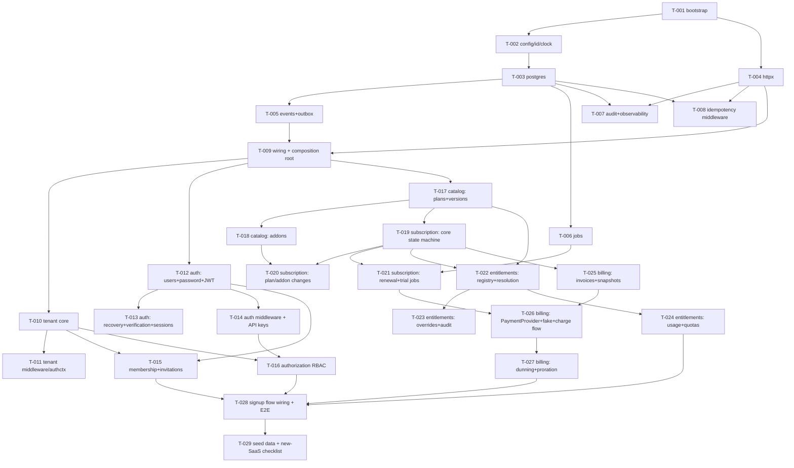

# Implementation Task Breakdown

Companion to [`docs/PLAN.md`](./PLAN.md). Each task is sized to be implementable by one person/agent in one focused session, is self-contained (read PLAN.md section referenced + this task card), and lists hard dependencies. Tasks with no dependency edge between them can be built in parallel.

## Conventions (apply to every task)

- **Read first**: `docs/PLAN.md` — especially "Key Decisions", "Repository Layout", and the module spec for the task at hand.
- **Branching & PRs**: one branch per task, named `feat/T-XXX-short-name`, cut from the latest `main`. Every task lands via a **pull request into `main`** — no direct merges to `main`. `main` stays green (CI must pass before merge).
- **Definition of done** (in addition to the task's acceptance criteria):
  - `make lint test build` passes.
  - New code follows the hexagonal layout (`domain` / `app` / `ports` / `adapters`) and the import rules: `domain` imports nothing from other layers/modules; modules import other modules only via their `ports` package.
  - Domain logic has unit tests; adapters touching Postgres have integration tests (testcontainers).
  - Migrations live in `migrations/<module>/` and run via the migration runner.
  - Public behavior documented in the package's doc comment (godoc), not a separate wiki.
- **Don't gold-plate**: implement exactly the task's scope. "Out of scope" notes are binding.
- **Money**: always integer minor units (cents) + currency code. Never floats.
- **Time**: always through `platform/clock`, UTC. Never `time.Now()` in domain/app code.
- **Size legend**: S ≈ ≤ half day, M ≈ one day, L ≈ 1–2 days.

## Dependency graph

---

## Milestone 1 — Foundation

### T-001 · Project bootstrap · **S**
**Depends on**: nothing.
**Deliverables**: `go.mod` (module path `github.com/williamokano/entitlements`, latest stable Go); empty directory skeleton from PLAN.md "Repository Layout" (use `.gitkeep` or doc.go stubs); `Makefile` with `build`, `test`, `lint`, `generate` (sqlc), `migrate-up/down`, `run` targets; `docker-compose.yml` with Postgres 16+; `.golangci.yml` (enable `depguard` placeholder — rules filled in T-009); GitHub Actions workflow running `make lint test build`; README "Development" section (prereqs, `docker compose up`, `make run`).
**Acceptance**: fresh clone → `docker compose up -d && make lint test build` succeeds; CI green.

### T-002 · `platform/config`, `platform/id`, `platform/clock` · **S**
**Depends on**: T-001.
**Deliverables**: env-based config loader (struct tags, `.env` support for dev, fail-fast on missing required vars); UUIDv7 generator behind `id.Generator` interface; `clock.Clock` interface with real + frozen test implementation.
**Acceptance**: unit tests for parsing/defaults/missing-var failure; deterministic clock usable in tests.

### T-003 · `platform/postgres` — pool, UnitOfWork, migrations, sqlc · **M**
**Depends on**: T-002.
**Deliverables**: pgx/v5 pool construction from config; `UnitOfWork`/tx manager exposing `func (u UnitOfWork) Do(ctx, func(ctx) error) error` where the tx travels in `ctx` so repositories join ambient transactions; goose migration runner over embedded per-module FS (`migrations/<module>/`); `sqlc.yaml` scaffolding + `make generate`; one Postgres **schema per module** convention documented and helper for creating schemas in migration 0.
**Acceptance**: testcontainers integration test: migrations apply cleanly; a tx rolls back all writes on error; nested `Do` joins the outer tx.

### T-004 · `platform/httpx` — server, middleware, errors · **M**
**Depends on**: T-001.
**Deliverables**: `net/http` server with graceful shutdown; middleware chain: request-ID (accept inbound header or generate), panic recovery, request logging; RFC 7807 `problem+json` error mapping from typed app errors (`NotFound`, `Conflict`, `Validation`, `Unauthorized`, `Forbidden`); `/healthz` + `/readyz`; router composition helper so each module later mounts its own `http.Handler` under a prefix.
**Acceptance**: `httptest` coverage for each middleware and the error mapper; panic returns 500 problem+json with request ID.

### T-005 · `platform/events` — bus, transactional outbox, idempotent consumers · **L** ← the backbone
**Depends on**: T-003.
**Deliverables** (see PLAN.md "Outbox scope note"): `Event` envelope (uuidv7 ID, occurred_at, tenant_id, module, type, JSON payload); `Bus` interface with `Subscribe(eventType, handler)`; `Append(ctx, evt)` writing to `platform.outbox` **inside the ambient UnitOfWork tx**; relay worker polling `FOR UPDATE SKIP LOCKED` in batches, dispatching to subscribers, marking `published_at`, incrementing `attempts`, with backoff on failure; `platform.processed_events` (consumer, event_id PK) + wrapper making any handler exactly-once-effective; test helper for synchronous dispatch in unit tests.
**Acceptance**: integration tests proving (1) event is NOT visible if the business tx rolls back, (2) event survives relay crash and is redelivered, (3) idempotent wrapper drops the duplicate delivery.

### T-006 · `platform/jobs` — scheduler + locked runner · **M**
**Depends on**: T-003.
**Deliverables**: `jobs.Register(name, interval, fn)`; runner using Postgres advisory locks so exactly one instance executes a job across replicas; per-run timeout, panic isolation, slog + last-run bookkeeping table.
**Acceptance**: integration test with two runners on one DB — each tick executes the job exactly once.

### T-007 · `platform/audit` + observability baseline · **M**
**Depends on**: T-003, T-004.
**Deliverables**: `audit.Writer.Record(ctx, Entry{Actor, TenantID, Action, Resource, Before, After, Reason})` persisting to `platform.audit_log` (append-only) within the ambient tx; slog setup: JSON handler, request/tenant/trace IDs auto-attached from context; OpenTelemetry TracerProvider/MeterProvider wiring (no-op exporters by default, OTLP via config); HTTP middleware creating a span per request.
**Acceptance**: unit + integration tests; a request produces one log line with request ID and one span; audit entries visible after commit only.

### T-008 · `platform/httpx` idempotency-key middleware · **S**
**Depends on**: T-003, T-004.
**Deliverables**: middleware honoring `Idempotency-Key` header on mutating methods: first call stores response (status+body hash) in `platform.idempotency_keys` keyed by (tenant, key, route), TTL; replay returns stored response; concurrent duplicate gets `409`.
**Acceptance**: integration test: duplicate POST returns identical response without re-executing the handler.

### T-009 · Module wiring pattern + composition root + arch enforcement · **M**
**Depends on**: T-004, T-005.
**Deliverables**: `Module` contract — each module's `module.go` exposes `Wire(Deps) (Ports, http.Handler, []events.Subscription)`; `cmd/api/main.go` composition root: config → postgres → migrations → bus/relay → jobs → mount modules → serve; a minimal `example` module (one entity, one endpoint, one event) proving the pattern end-to-end, kept as living documentation; finalize `depguard`/`go-arch-lint` rules from PLAN.md "Enforced rules" and turn them on in CI.
**Acceptance**: `make run` boots; example endpoint works; a deliberate illegal import (module → other module's `domain`) fails `make lint`.

---

## Milestone 2 — Identity core

### T-010 · Tenant module core · **M**
**Depends on**: T-009. **Spec**: PLAN.md §1.
**Deliverables**: `Tenant` aggregate (uuid, slug, name, status `active|suspended|deleted`, `settings JSONB`); create/update/suspend/soft-delete use cases; slug uniqueness; **provisioning pipeline**: ordered hook registry executed on `TenantCreated` (hooks registered at composition root; ship a logging no-op hook); publishes `TenantCreated/Suspended/Deleted`; REST: CRUD under `/api/v1/tenants`; `ports.TenantReader` (GetByID/GetBySlug, status check) for other modules.
**Acceptance**: unit tests on lifecycle transitions; integration test: create → event in outbox → hooks ran.

### T-011 · Tenant resolution middleware + `platform/authctx` · **S**
**Depends on**: T-010.
**Deliverables**: `authctx` carrying `Principal` (user or API key; filled by T-014) and `TenantID`; middleware resolving tenant from (in order) JWT claim → `X-Tenant-ID` header → subdomain, validating via `ports.TenantReader` (must be `active`); repository guard helper `authctx.MustTenant(ctx)` used by all tenant-scoped repos; explicit `WithSystemContext` escape hatch for admin/jobs paths.
**Acceptance**: httptest matrix: header/claim/subdomain resolution, suspended tenant → 403, missing tenant on scoped route → 400.

### T-012 · Authentication: users, password factor, JWT + refresh rotation · **L**
**Depends on**: T-009. **Spec**: PLAN.md §2.
**Deliverables**: `User` (global, NOT tenant-scoped: id, email unique, status) with credentials modeled as **factors** (`password` first; table ready for `totp`/`webauthn`); argon2id hashing with tuned params; register + login use cases; login returns JWT access (short TTL, includes user id; tenant claim added by client flow later) + refresh token (opaque, hashed at rest) with **rotation and family-reuse detection** (reuse → revoke family); logout (revoke); token signing keys from config with `kid` header for future rotation; REST under `/api/v1/auth`; publishes `UserRegistered`, `LoginSucceeded/Failed`; login rate-limit hook interface (in-memory default).
**Out of scope**: email verification, recovery, SSO, TOTP (models must accommodate them).
**Acceptance**: unit tests on rotation/reuse-detection state machine; integration: register→login→refresh→reuse-old-token revokes family.

### T-013 · Authentication: email verification, recovery, session management · **M**
**Depends on**: T-012.
**Deliverables**: `EmailSender` port + dev adapter (logs the link); email verification flow (single-use expiring token); password recovery (request → token → reset, invalidates sessions); password change (re-auth required); session listing + revoke-others; publishes `PasswordChanged/Recovered`, audit entries via `platform/audit`.
**Acceptance**: integration tests for each flow incl. token expiry/single-use.

### T-014 · Auth middleware + API keys (machine auth) · **M**
**Depends on**: T-012.
**Deliverables**: HTTP middleware validating `Authorization: Bearer` JWT → `authctx.Principal{Kind: user}`; API keys: create/revoke per tenant (prefix + argon2id-hashed secret, shown once), scopes list, `last_used_at`; middleware branch for `Authorization: ApiKey …` → `Principal{Kind: machine, Scopes}`; REST for key management.
**Acceptance**: matrix tests: valid/expired/garbage JWT; valid/revoked key; scope surfaced in `authctx`.

### T-015 · Tenant membership + invitations · **M**
**Depends on**: T-010, T-012. **Spec**: PLAN.md §1.
**Deliverables**: membership (user↔tenant, role reference string, status); invitation flow: invite by email (existing or future user), accept/decline, expiry, resend; publishes `MemberJoined/Left`, `InvitationSent`; REST under `/api/v1/tenants/{id}/members|invitations`; `ports.MembershipReader` for authorization.
**Acceptance**: integration: invite → register with same email → accept → member; expiry rejected.

### T-016 · Authorization module (dynamic RBAC) · **M**
**Depends on**: T-010, T-014. **Spec**: PLAN.md §3.
**Deliverables**: `Role` (tenant-scoped, name, permissions `[]string` in `resource:action` form, `system bool`); seed `owner/admin/member` via a tenant provisioning hook (registered in composition root); role CRUD (system roles immutable); assign/unassign to members; `ports.Authorizer.Check(ctx, permission) error` + `RequirePermission(perm)` HTTP middleware (wildcard `resource:*` supported); replaceable behind port (ABAC later).
**Acceptance**: unit tests for permission matching incl. wildcards; integration: custom role grants access, system role deletion → 409.

---

## Milestone 3 — Product core

### T-017 · Catalog: plans, versions, pricing · **L**
**Depends on**: T-009. **Spec**: PLAN.md §4.
**Deliverables**: `Plan` + immutable `PlanVersion` (publish creates new version; subscriptions will pin versions); lifecycle `draft→active→archived`, public/hidden; per version: prices per billing cycle (`monthly|annual|custom(interval)`) with currency + minor units, trial config (enabled, days, card_required), grace period days, feature grants list (`feature_key → value`; keys are free-form strings — the registry lives in entitlements, validation is soft/warn); REST: admin CRUD + public "list active public plans"; `ports.CatalogReader.GetPlanVersion(id)`; publishes `PlanVersionPublished/PlanArchived`.
**Acceptance**: unit: publishing freezes a version (mutating published version → error); integration: full CRUD + public listing excludes hidden/draft.

### T-018 · Catalog: addons · **M**
**Depends on**: T-017. **Spec**: PLAN.md §4.
**Deliverables**: `Addon` with own pricing per cycle, compatible-plan list, entitlement deltas (`feature_key → limit_delta | value override`), quantity-allowed flag; versioned like plans; REST CRUD; exposed via `ports.CatalogReader`.
**Acceptance**: unit + integration; incompatible plan/addon pairing rejected at read API level (helper other modules reuse).

### T-019 · Subscription: core state machine · **L**
**Depends on**: T-017. **Spec**: PLAN.md §5.
**Deliverables**: `Subscription` aggregate: tenant_id (one active subscription per tenant in the skeleton), pinned plan_version_id, billing cycle, state machine `trialing→active→past_due→grace→suspended→canceled|expired` as an explicit transition table (illegal transition → typed error); transition history table (from, to, reason, actor, at); current period (start/end, next_renewal_at) computed via `clock`; use cases: create (trial or direct-active per plan config), cancel (immediate | at period end), reactivate, pause/resume; publishes `SubscriptionCreated/Activated/Canceled/Suspended/...`; REST under `/api/v1/subscription`; `ports.SubscriptionReader` (current subscription + state for a tenant).
**Out of scope**: renewals (T-021), plan changes (T-020), any billing calls.
**Acceptance**: exhaustive unit table-test over the transition matrix; integration: create-with-trial sets `trialing` + period from plan's trial days; every transition recorded in history + outbox.

### T-020 · Subscription: plan changes + addon attach/detach · **M**
**Depends on**: T-018, T-019.
**Deliverables**: upgrade (immediate: re-pin plan version, emit `SubscriptionPlanChanged` with old/new snapshot refs); downgrade as **scheduled change** (stored, applied at period end by a hook T-021's renewal job calls); cancel-scheduled-change; addon attach/detach with quantity, compatibility validated via catalog port, emits `SubscriptionAddonChanged`; proration is **not computed here** — events carry enough data for billing to prorate.
**Acceptance**: unit: downgrade doesn't change entitlements-relevant state until applied; integration: scheduled change persisted and visible via REST.

### T-021 · Subscription: renewal + trial jobs · **M**
**Depends on**: T-006, T-019.
**Deliverables**: recurring job scanning due subscriptions: emits `SubscriptionRenewalDue` (billing consumes later), applies scheduled changes at period rollover, advances period **only after** `InvoicePaid` (subscribe to billing event — until T-026 exists, a config flag `billing.disabled=true` lets renewal auto-advance so the module is testable standalone); trial job: `TrialEnding` (configurable days before), `TrialEnded` → convert to active (card on file not enforced in skeleton) or `expired` per plan config.
**Acceptance**: integration with frozen clock: advance time → renewal event emitted exactly once (idempotent consumer); trial expiry path drives state machine correctly.

### T-022 · Entitlements: feature registry + resolution pipeline · **L** ← core of the product
**Depends on**: T-017, T-019. **Spec**: PLAN.md §6.
**Deliverables**: feature registry CRUD (`key`, `type: boolean|limit|config|enum`, default value, description, `limit_behavior: soft|hard`, `reset_period: billing_cycle|monthly|never`); **resolution pipeline**: plan-version grants → addon deltas (×quantity) → tenant overrides ⇒ effective set, precedence exactly as specified; materialized `effective_entitlements` per tenant, rebuilt by idempotent consumers of `SubscriptionCreated/PlanChanged/AddonChanged/Canceled`, `PlanVersionPublished` (affected tenants), and override changes; **unknown-feature policy** (`default_deny|default_allow`) from config; runtime REST: `GET /entitlements` (all, one call), `GET /entitlements/{key}`; `ports.EntitlementsReader.Get(ctx, key)`.
**Out of scope**: overrides CRUD (T-023), usage/consume (T-024).
**Acceptance**: table-driven unit tests over precedence (the "plan says 10, addon +10 ⇒ 20" case explicitly); integration: subscription plan change event → materialized set updated.

### T-023 · Entitlements: tenant overrides + audit · **M**
**Depends on**: T-022.
**Deliverables**: override CRUD (feature_key, value or delta, optional `expires_at`, mandatory reason + actor) via admin REST; expiry enforced by a T-006 job that re-resolves affected tenants; every change audited via `platform/audit`; override changes trigger re-materialization.
**Acceptance**: integration: override boosts limit, expiry reverts it; audit trail complete (who/what/when/why).

### T-024 · Entitlements: usage tracking + quota enforcement · **M**
**Depends on**: T-022.
**Deliverables**: usage counters per (tenant, feature, period); `ConsumeQuota(ctx, key, n)` — single-statement atomic check-and-increment honoring hard limits (typed `QuotaExceeded` error) and soft limits (consume + emit `EntitlementLimitWarning`); `ReleaseQuota`, `GetUsage`; period reset per feature `reset_period` (lazy on access — no job needed); **downgrade grace**: when re-resolution shrinks a limit below current usage, emit `EntitlementExceeded` (never block reads); REST: `POST /entitlements/{key}/consume`, `GET /usage`.
**Acceptance**: concurrency test: parallel consumes never exceed a hard limit; soft-limit warning emitted once per threshold crossing; downgrade-below-usage emits event and keeps serving.

### T-025 · Billing: invoices + line-item snapshots · **M**
**Depends on**: T-019. **Spec**: PLAN.md §7.
**Deliverables**: `Invoice` aggregate: lifecycle `draft→open→paid|void|uncollectible`; line items **snapshotting** plan/addon name, version, unit price, quantity, currency at issuance (copied values, no FK-following for display); per-tenant invoice number sequence (`INV-{tenant-seq}`); totals in minor units; `TaxCalculator` port (no-op default); credit-note entity for refunds; REST: list/get invoices for tenant.
**Acceptance**: unit: mutating a published catalog plan does NOT change an issued invoice's lines; integration: numbering is gapless-per-tenant under concurrency.

### T-026 · Billing: `PaymentProvider` port, fake provider, charge flow · **L**
**Depends on**: T-021, T-025.
**Deliverables**: `PaymentProvider` port: `CreateCustomer`, `AttachPaymentMethod`, `Charge(idempotencyKey, …)`, `Refund`, plus `TranslateWebhook(req) (ProviderEvent, error)` normalization interface; `fakeprovider`: auto-succeeds, programmable failures for tests, in-memory; payment-method storage (tokens only); idempotent consumer of `SubscriptionRenewalDue`: draft→open invoice → charge → on success mark paid + emit `InvoicePaid`; on failure emit `PaymentFailed`; idempotency keys on every provider call derived from (invoice, attempt); subscription consumes `InvoicePaid` to advance period (removes the T-021 `billing.disabled` flag path).
**Acceptance**: integration over the full renewal flow with fakeprovider (success + failure); duplicate `SubscriptionRenewalDue` delivery produces exactly one charge.

### T-027 · Billing: dunning + proration · **M**
**Depends on**: T-026.
**Deliverables**: dunning schedule from config (default `+1d,+3d,+7d`) driven by T-006 jobs: retries charge, emits `PaymentRecovered` or, after exhaustion, `DunningExhausted`; subscription consumes these for `past_due→grace→suspended` transitions (grace length from plan version); `ProrationStrategy` interface (`immediate_prorated | none | credit_next_invoice`) with `immediate_prorated` implemented, invoked on `SubscriptionPlanChanged`, producing a prorated invoice or credit line.
**Acceptance**: frozen-clock integration: fail → retries at configured offsets → recovery path and exhaustion path both drive subscription states correctly; proration math unit-tested (mid-period upgrade charges the difference for remaining days).

---

## Milestone 4 — Hardening & assembly

### T-028 · Signup flow wiring + cross-cutting E2E suite · **L**
**Depends on**: T-015, T-016, T-024, T-027.
**Deliverables**: composition-root provisioning hooks: on `TenantCreated` → seed system roles (T-016 hook), create trial subscription on configured default plan; E2E tests (testcontainers, real HTTP) for the three PLAN.md flows: **signup** (register → create tenant → trial → entitlements materialized), **renewal** (clock-advance → invoice → fake charge → period advances / dunning on failure), **upgrade with addon** (10 → 20 limit visible via `GET /entitlements`).
**Acceptance**: all three E2E scenarios green in CI; no `WithSystemContext` leaks into request paths (grep-gate in lint).

### T-029 · Seed/demo data + "new SaaS" checklist · **S**
**Depends on**: T-028.
**Deliverables**: `make seed` — demo features, two plans (free/pro) + one addon, demo tenant/user; README "Starting a new SaaS from this skeleton" checklist: rename module path, pick payment provider adapter, define features/plans, register provisioning hooks, configure unknown-feature policy, enable/disable modules; document the phase-2 backlog (webhooks module, admin API, metering, coupons, SSO/TOTP) referencing PLAN.md.
**Acceptance**: fresh clone → compose up → `make migrate-up seed run` → signup E2E flow executable via curl script in `docs/`.

---

## Suggested parallel lanes

| Lane | Tasks in order |
|---|---|
| A (platform) | T-001 → T-002 → T-003 → T-005 → T-006 |
| B (platform) | T-004 → T-007 → T-008 (after T-003) |
| — sync point — | T-009 (needs A+B) |
| C (identity) | T-010 → T-011 → T-015 |
| D (identity) | T-012 → T-013 / T-014 → T-016 |
| E (product) | T-017 → T-018 → T-020 |
| F (product) | T-019 → T-021 → T-025 → T-026 → T-027 |
| G (product) | T-022 → T-023 / T-024 |
| — final — | T-028 → T-029 |
